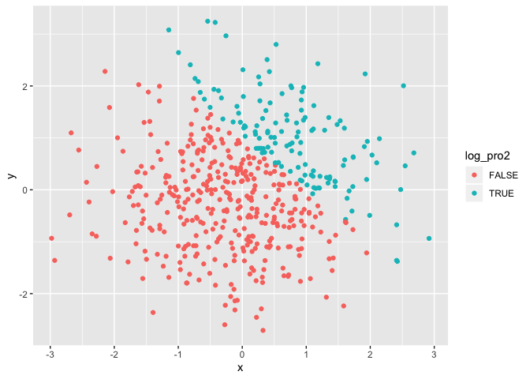
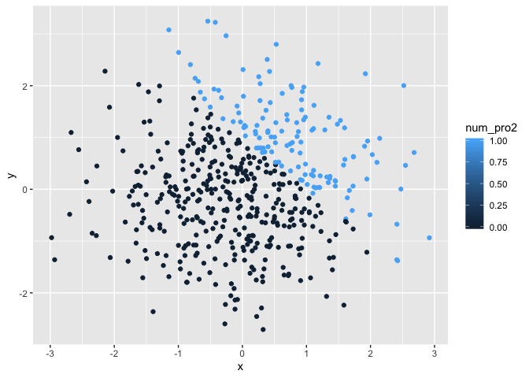

p8015\_hm1\_xw2676
================

\#Problem
    1

``` r
library(tidyverse)
```

    ## ── Attaching packages ───────────────────────────────────────────────── tidyverse 1.2.1 ──

    ## ✔ ggplot2 3.2.1     ✔ purrr   0.3.2
    ## ✔ tibble  2.1.3     ✔ dplyr   0.8.3
    ## ✔ tidyr   0.8.3     ✔ stringr 1.4.0
    ## ✔ readr   1.3.1     ✔ forcats 0.4.0

    ## ── Conflicts ──────────────────────────────────────────────────── tidyverse_conflicts() ──
    ## ✖ dplyr::filter() masks stats::filter()
    ## ✖ dplyr::lag()    masks stats::lag()

``` r
  vec_numeric = rnorm(8)
  vec_logical = vec_numeric > 0
  vec_char = c("a","a","a","a","a","a","a","")
  vec_factor = factor(c("a","a","b","b","b","c","c","c"))
hm1_df = tibble(
  vec_numeric,
  vec_logical,
  vec_char,
  vec_factor
)

mean(hm1_df$vec_numeric)
```

    ## [1] 0.09196931

``` r
mean(hm1_df$vec_logical)
```

    ## [1] 0.5

``` r
mean(hm1_df$vec_char)
```

    ## Warning in mean.default(hm1_df$vec_char): argument is not numeric or
    ## logical: returning NA

    ## [1] NA

``` r
mean(hm1_df$vec_factor)
```

    ## Warning in mean.default(hm1_df$vec_factor): argument is not numeric or
    ## logical: returning NA

    ## [1] NA

The numeric vector and logical vector work but character and factor
vector don’t work.

``` r
num_log = as.numeric(vec_logical) 
num_char = as.numeric(vec_char) 
num_factor = as.numeric(vec_factor)
```

The “False” of the logical vector became “0”, the “TRUE” of the logical
vector became “1”. And we cannot change character vector into numeric
vector. The factor vector is changed to numeric vector by its
    levels.

``` r
as.numeric(vec_logical) * vec_numeric
```

    ## [1] 0.5194198 1.1373403 0.0000000 0.0000000 0.0000000 0.9851085 0.0000000
    ## [8] 0.6517097

``` r
as.factor(vec_logical) * vec_numeric
```

    ## Warning in Ops.factor(as.factor(vec_logical), vec_numeric): '*' not
    ## meaningful for factors

    ## [1] NA NA NA NA NA NA NA NA

``` r
as.numeric(as.factor(vec_logical)) * vec_numeric
```

    ## [1]  1.0388396  2.2746806 -0.1735445 -1.0630986 -0.3754976  1.9702170
    ## [7] -0.9456831  1.3034193

\#Problem 2 Create a data frame

``` r
x = rnorm(500)
y = rnorm(500)
log_pro2 = x + y > 1
num_pro2 = as.numeric(log_pro2)
fac_pro2 = as.factor(log_pro2)
pro2_df = tibble(
  x,y,log_pro2,num_pro2,fac_pro2
)
```

Write a short description of your vector

the size of the dataset is row = 500 and col = 5

the mean of x is -0.1070862

the median of x is -0.0869974

the standard deviation of x is 1.021257

the proportion of cases for which x + y \> 1 is 0.002

``` r
#Make a scatterplot
scatterplot1 = ggplot(pro2_df, aes(x = x, y = y,color = log_pro2)) + geom_point()
scatterplot2 =ggplot(pro2_df, aes(x = x, y = y,color = num_pro2)) + geom_point()
scatterplot3 =ggplot(pro2_df, aes(x = x, y = y,color = fac_pro2)) + geom_point()
scatterplot1
```

<!-- -->

``` r
scatterplot2
```

<!-- -->

``` r
scatterplot3
```

<!-- -->

``` r
ggsave("scatterplot1.pdf", scatterplot1) # Export your first scatterplot to your project directory using ggsave
```

    ## Saving 7 x 5 in image

The scatterplot using logical vector as its color and that using factor
vector as its color have the same results, both according to “TRUE” and
“FALSE”. The scatterplot using numeric vector as its color as scales
from 0 to 1.
